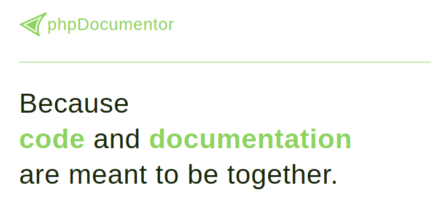
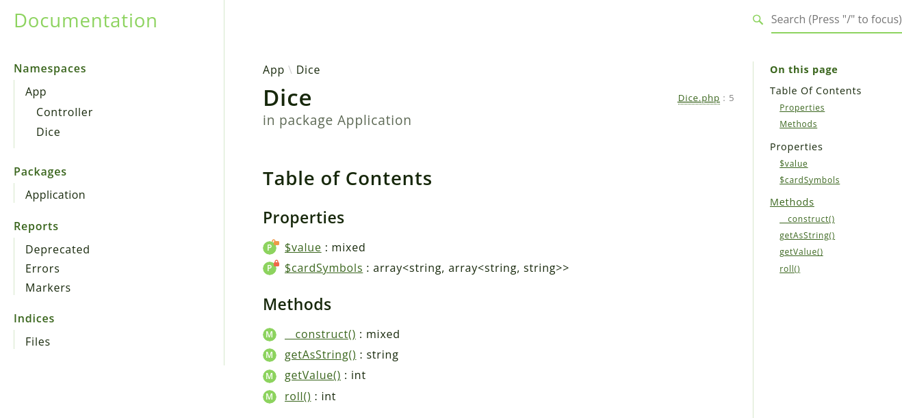

<!--
---
author: mos
revision:
    "2024-04-23": "(C, mos) Reviewed and config moved into tools/phpdoc."
    "2023-04-20": "(B, mos) Reviewed."
    "2022-03-27": "(A, mos) First release."
---
-->



Document your PHP code
==========================

This exercise will show you how to get going with documenting your code using the tool phpDocumentor and comments using DocBlock.

The tools you are going to install are really useful development tools.

<!--
TODO

* Add example on dockblock comments
* Show some images
-->

The tool phpDocumentor
--------------------------

The tool [phpDocumentor](https://www.phpdoc.org/) will read your source code and create a HTML documentation from it. This type of documentation is easy to keep up to date since it is generated from the actual source code it intends to document.

The recommendation is to install the tool in the directory `tools/` so it does not conflict with your application.

We will use the tool wget to download a PHAR containing the tool in one PHP executable.

```
# Go to the root of your Symfony directory
mkdir --parents tools/phpdoc
wget https://phpdoc.org/phpDocumentor.phar -O tools/phpdoc/phpdoc
chmod 755 tools/phpdoc/phpdoc
```

Verify that the tool can be executed.

```
tools/phpdoc/phpdoc --version
tools/phpdoc/phpdoc --help
```

Now you can execute the tool like this to generate the documentation from the code in `src/` and save it into `docs/api`.

```
tools/phpdoc/phpdoc run -d ./src -t ./docs/api
```

You can now open a web browser and point it to `docs/api`.

It can look like this when inspecting a class.




### Configuration file

You can add a configuration file [`phpdoc.xml`](phpdoc.xml) to your project. In the configuration file can you configure the settings used when generating the documentation.

Place the configuration file in `tools/phpdoc/phpdoc.xml` and add it to your git repo.

You can then execute the tool like this.

```
tools/phpdoc/phpdoc --config=tools/phpdoc/phpdoc.xml
```


### Git ignore .phpdoc/

You should Git ignore the directory `.phpdoc/` that contains a cache of the genererated documentation. It is quite large and does not need to be part of your Git repository.

Add the following line to your file `.gitignore`.

```
.phpdoc/
```


### Git include docs/

You might think that it is good to exclude the docs directory and that is fine. The documentation can be regenerated and should perhaps not be included in the repo. On the other hand, it might be useful to include the docs within the repo to make it easier for the user to get access to it.

Let your use case decide what you do. In this example it is fine to include the `docs/api` into the git repo.


DocBlock comments
--------------------------

When phpdoc parses the source code it also detects comments in the code that is written as [DocBlock comments](https://docs.phpdoc.org/latest/guide/references/phpdoc/basic-syntax.html).

It is up to you to add DocBlock comments to your code. This type of comments are usually put as a header to the file, the class, the method or the property providing a description and additional details.

You recognize a DockBlock comment by its structure with the starting token `/**` and the ending token `*/`. The comment usually looks like this.

```
/**
 * Description of the file, class, method, property.
 */
```

The easiest way to learn DockBlock comments might be to view a class as an example.

* [Symfony Request class](https://github.com/symfony/symfony/blob/6.1/src/Symfony/Component/HttpFoundation/Request.php)

You can now try to add a few DocBlock comments to one of your own classes and then regenerate the documentation to see how it looks like.


Composer scripts
--------------------------

To make it easier to execute the tools you can add them to the script section of your `composer.json`.

This is how you can add the scripts.

```
{
    "scripts": {
        "phpdoc": "tools/phpdoc/phpdoc --config=tools/phpdoc/phpdoc.xml"
    }
}
```

You can verify that your update did not make the `composer.json` corrupt by running the following command.

```
composer validate
```

If all seems okey you should be able to execute the tool like this.

```
composer phpdoc
```

You can read more on "[composer and writing custom commands](https://getcomposer.org/doc/articles/scripts.md#writing-custom-commands)".
