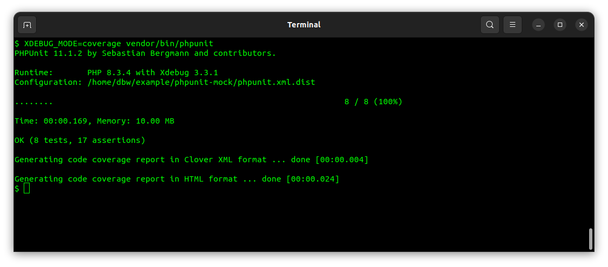

<!--
---
author: mos
revision:
    "2024-04-23": "(B, mos) Reviewed and included in kmom04, upgrader to PHP82 and phpunit 11."
    "2022-03-27": "(A, mos) First release."
---

-->



PHPUnit how to mock object
===================================

This is an example of how to mock test objects to ease testing. This shows how a DiceHand uses a mocked Dice object that always returns a 6.

This is documented in the manual "[Chapter 9. Test Doubles](https://docs.phpunit.de/en/11.1/test-doubles.html)".


Get going with the example
-----------------------------------

If you already have an application, feel free to include the code samples in your working application. Perhaps you already have a `Dice` and `DiceHand` that you can adapt the tests to.

This is how to get going with the example if you do not have such an environment.

First install the environment.

```
composer install
```

Then run the test suite. The test script is part of the `composer.json` file.

```
composer test
```

Check out the code coverage by opening a browser to the `build/coverage/` folder.

When you are done you may clean up all the generated files. The test script is part of the `composer.json` file.

```
composer clean
```


A test case for a mocked Dice
-----------------------------------

In the file [`tests/Game/DiceTest.php`](./tests/Game/DiceTest.php) the following test case shows how to create a stubbed object enabling a Dice that always returns a 6.

```php
/**
 * Create a mocked object that always returns 6.
 */
public function testStubRollDiceLastRoll()
{
    // Create a stub for the Dice class.
    $stub = $this->createMock(Dice::class);

    // Configure the stub.
    $stub->method('roll')
         ->willReturn(6);

    $res = $stub->roll();
    $exp = 6;
    $this->assertEquals($exp, $res);
}
```

This test case is executed when testing the Dice class in isolation.


A test case for a mocked Dice in DiceHand
-----------------------------------

In the file [`tests/Game/DiceHandTest.php`](./tests/Game/DiceHandTest.php) the following test case shows how to create a stubbed Dice (always returning 6) that is injected into the DiceHand.

```php
/**
 * Stub the dices to assure the value can be asserted.
 */
public function testAddStubbedDices()
{
    // Create a stub for the Dice class.
    $stub = $this->createMock(Dice::class);

    // Configure the stub.
    $stub->method('roll')
        ->willReturn(6);
    $stub->method('lastRoll')
        ->willReturn(6);

    $dicehand = new DiceHand();
    $dicehand->addDice(clone $stub);
    $dicehand->addDice(clone $stub);
    $dicehand->roll();
    $res = $dicehand->sum();
    $this->assertEquals(12, $res);
}
```

This test case is executed when testing the DiceHand class that needs Dice to work.


Mock, subclass or rewrite the code?
-----------------------------------

One alternative to using stub objects like above, would be to create an inherited Dice class, pure for test purposes, and inject that into the DiceHand.

Another alternative would be to evaluate if the code could be rewritten to be easier to test.

But, in the case above, it seems like an easy solution to add a stub to make it easier to perform tests of the DiceHand.
