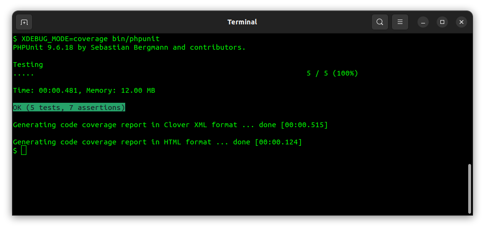
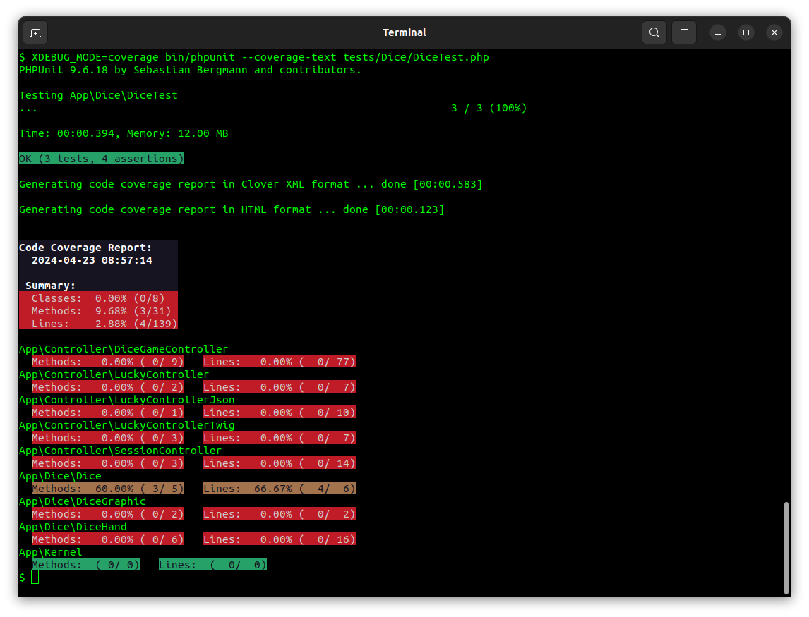
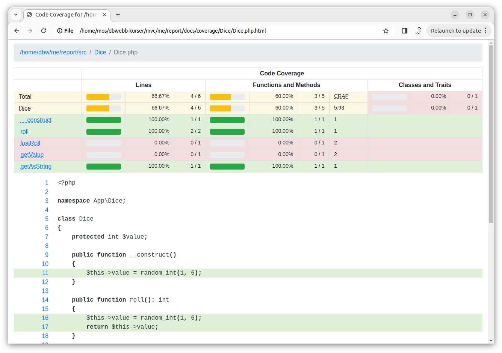

<!--
---
author: mos
revision:
    "2024-04-23": "(C, mos) Reviewed."
    "2023-04-20": "(B, mos) Reviewed."
    "2022-03-27": "(A, mos) First release."
---
-->



Run unit tests with PHPUnit in Symfony
==========================

This exercise will show you how to get going with unit testing in Symfony using PHPUnit.

This short article is based on the longer Symfony documentation article "[Testing](https://symfony.com/doc/current/testing.html)". You can head over to that article after you have completed the installation in this article. The important parts are about unit test, you can skip (or read fast) the parts of integration and application tests.

<!--
TODO

* Include code samples in the exercise and make a step by step on how to add tests.
* Add section on troubleshooting
  * class not found
-->


Install PHPUnit
--------------------------

The tool [PHPUnit](https://phpunit.de/) will help you create and execute unit tests for your code.

Symfony integrates with PHPUnit and we can use composer to install it. Symfony will add its own layer of helpers on top of PHPUnit.

```
# Go to the root of your Symfony directory
composer require --dev symfony/test-pack
```

Verify that the tool can be executed.

```
bin/phpunit
```


### Configuration file

Symfony adds the PHPUnit configuration file as `phpunit.xml.dist` and it will be enough to start with.


First test case
--------------------------

Lets setup the first test suite and execute it. Here are the example code you can use for it. Copy the code to your installation of Symfony.

* [`src/Dice/Dice.php`](src/Dice/Dice.php)
* [`tests/Dice/DiceTest.php`](tests/Dice/DiceTest.php)

Execute the test suite.

```
bin/phpunit
```

It could look like this showing that the test suite was successfully executed and it contains one test case and two assertions.

```
PHPUnit 9.6.18 by Sebastian Bergmann and contributors.

Testing 
.                                                                   1 / 1 (100%)

Time: 00:00.205, Memory: 8.00 MB

```

You have now executed your first unit test within Symfony.


Code coverage report
--------------------------

Let's generate a code coverage report from the test suite.

You need to have installed [Xdebug](https://xdebug.org/) to generate code coverage reports.


### Code coverage as text

Execute the test suite and generate a code coverage report as text.

```
XDEBUG_MODE=coverage bin/phpunit --coverage-text tests/Dice/DiceTest.php
```

You will get a report for all your classes. You should be able to see the Dice class, with a report looking something like this.

```
App\Dice\Dice
  Methods:  66.67% ( 2/ 3)   Lines:  50.00% (  2/  4)
```




### Code coverage as HTML

We can generate code coverage as HTML. To do so we update the configuration file `phpunit.xml.dist` with a report instruction on the code coverage.

You should place that section within the `<coverage>` and `</coverage>`. You can see a complete configuration filen in [`phpunit.xml.dist`](phpunit.xml.dist).

```xml
<coverage>
  ...
  <report>
    <clover outputFile="docs/coverage.clover"/>
    <html outputDirectory="docs/coverage" lowUpperBound="35" highLowerBound="70"/>
  </report>
</coverage>
```

When the test suite is executed and the code coverage reports are generated it might look like this in the output.

```
Generating code coverage report in Clover XML format ... done [00:00.167]

Generating code coverage report in HTML format ... done [00:00.060]
```

The Clover XML format is easy to use for other tools, for example when you want an external tool to visualize the code coverage report. That is why we include it as the default of your setup.

The HTML report is generated in the directory `docs/coverage`, open it up with your web browser. Find the coverage for the Dice class and try to add another test case with assertions to make it fully cover the class.

The report can look like this in your browser.




Composer scripts
--------------------------

To make it easier to execute the tool you can add it to the script section of your `composer.json`.

This is how you can add the scripts.

```
{
    "scripts": {
        "phpunit": "XDEBUG_MODE=coverage vendor/bin/phpunit"
    }
}
```

You can verify that your update did not make the `composer.json` corrupt by running the following command.

```
composer validate
```

If all seems okey you should be able to execute the tool like this.

```
composer phpunit
```

You can read more on "[composer and writing custom commands](https://getcomposer.org/doc/articles/scripts.md#writing-custom-commands)".
