<!--
---
author: mos
revision:
    "2024-04-30": "(C, mos) Reviewed and minor updates to Symfony 7 and adding examples on custom queries."
    "2023-04-27": "(B, mos) Reviewed."
    "2022-03-27": "(A, mos) First release."
---

-->


Symfony and Doctrine
==========================

This exercise will show you how to get going with the Doctrine ORM framework to integrate with a database within your Symfony project. ORM stands for "object relational mapping" and is a way to work in an object-oriented manner toward a relational database.

<!--
TODO

* Enhance section on custom queries.
    * How to write native SQL and Doctrine QL.

* Perhaps in own article
    * How to work with relations.

* How to reinit database?

* How to unit test with database?

-->


<!-- Before Symfony 7
A walkthrough
-----------------------------------

There are two recordings where Mikael walks and talks you through this exercise.

The first video deals with setting up and creating the database and the base for the controller.

[](http://www.youtube.com/watch?v=fldtYEmD8sc "Del 1")

The second video deals with CRUD methods in the controller and how to work with the entity class, the repository class and the Doctrine entity manager.

[](http://www.youtube.com/watch?v=vqqpae3vyPA "Del 2")
-->


Preconditions
--------------------------

You have access to a Symfony web app.


About
--------------------------

You can quickly read [about Doctrine](https://www.doctrine-project.org/) on their website. Doctrine is a standalone ORM framework.

The core projects in Doctrine are the [Object Relational Mapper (ORM)](https://www.doctrine-project.org/projects/orm.html) and the [Database Abstraction Layer (DBAL)](https://www.doctrine-project.org/projects/dbal.html) it is built upon.

Symfony has an integration with Doctrine which is described in the article "[Databases and the Doctrine ORM](https://symfony.com/doc/current/doctrine.html)". You can have that article open in its own tab while you work through this exercise. This exercise is a shorter transcript from that article.


Install Doctrine
--------------------------

You can install Doctrin via the ORM Symfony pack.

```
# Go to the root of your Symfony directory
composer require symfony/orm-pack
composer require --dev symfony/maker-bundle
```

Now you are ready to start using Doctrine.


Configure the database URL
---------------------------

The `.env` files contain configuration details for your Symfony application.

Open your file `.env` in your editor and edit the `DATABASE_URL`. For this exercise, we will start using SQLite.

This is how the setting should look for SQLite.

```
DATABASE_URL="sqlite:///%kernel.project_dir%/var/data.db"
```

Comment out all other previous settings for the `DATABASE_URL`.

The database file will now be stored as `var/data.db`.


About DotEnv
---------------------------

Using `.env` files to configure your application is used by many frameworks and in many programming languages.

The concept first started with the [DotEnv for Ruby](https://github.com/bkeepers/dotenv) and it was then ported to other languages. There is for example a [PHP DotEnv](https://github.com/vlucas/phpdotenv). You can read more on [Configuring Symfony using .env](https://symfony.com/doc/current/configuration.html).

In the README for Ruby DotEnv there is a [table showing the order of the configuration files](https://github.com/bkeepers/dotenv#what-other-env-files-can-i-use) and with recommendations for which files should be checked into Git and which ones should not be checked in, given that you follow the recommendations and always have your secrets in the files ending with `.local`.

Symfony has configured your `.gitignore` to ensure that the `.env` files ending with `.local` are not added to your git repo. Ensure that the settings are there by checking out your `.gitignore` file.


Verify settings from Dotenv
--------------------------

You can verify the files and settings that are read by the DotEnv.

```
# Debug the dotenv
php bin/console debug:dotenv
```

This can be helpful to debug issues with the configuration settings.

It can look like this.

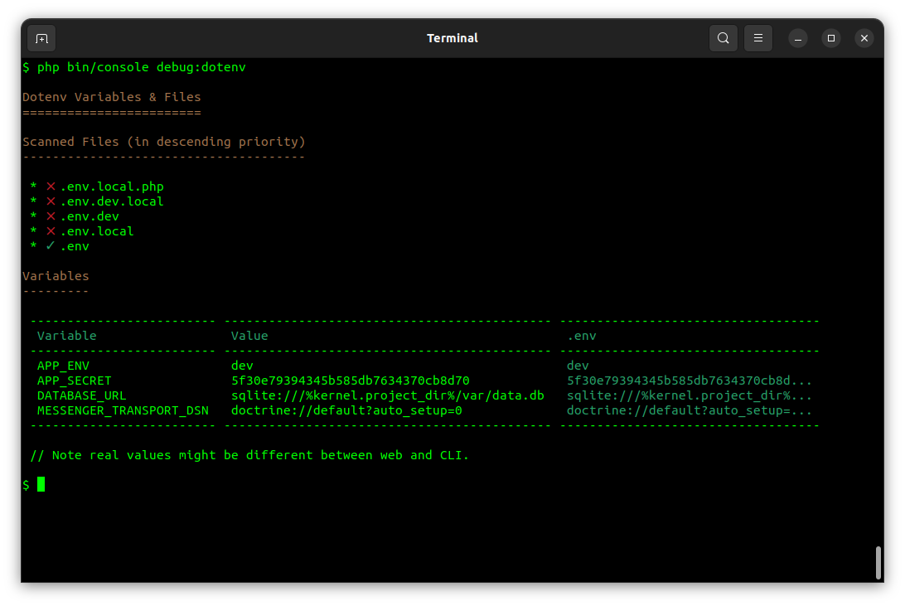


Create the database
---------------------------

You can now create the database.

```
php bin/console doctrine:database:create
```

This will create the database file `var/data.db`. You can now open it and check its schema which should be empty at first.

```
sqlite3 var/data.db
```

It can look like this.

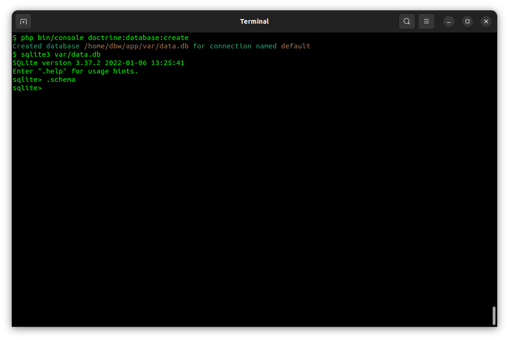


Create an Entity Class
---------------------------

You can now create an Entity Class, which is the class to hold the data to be saved to the database. You can see it as the class that represents the columns in the database table.

Run the command to create the product entity class.

```
php bin/console make:entity
```

Create a class called Product. Use the proposed defaults. Add two fields to the class with property name and type.

* name:string
* value:int

It can look like this.


The following files were created. Open them in your editor to review them and see how the two fields were implemented in the class.

```
created: src/Entity/Product.php
created: src/Repository/ProductRepository.php
```

The class in Entity represents a Product object, or one row, in the database table.

The class in Repository has the responsibility to write and read objects of the Product class to the database.


Create and run a migration
---------------------------

When you update your entities you need to apply those changes to the database using migrations. Migration is a script that takes the version of the database one step up or down.

Create the migration and inspect its result. 

```
php bin/console make:migration
```

It looks like this when the command is run.

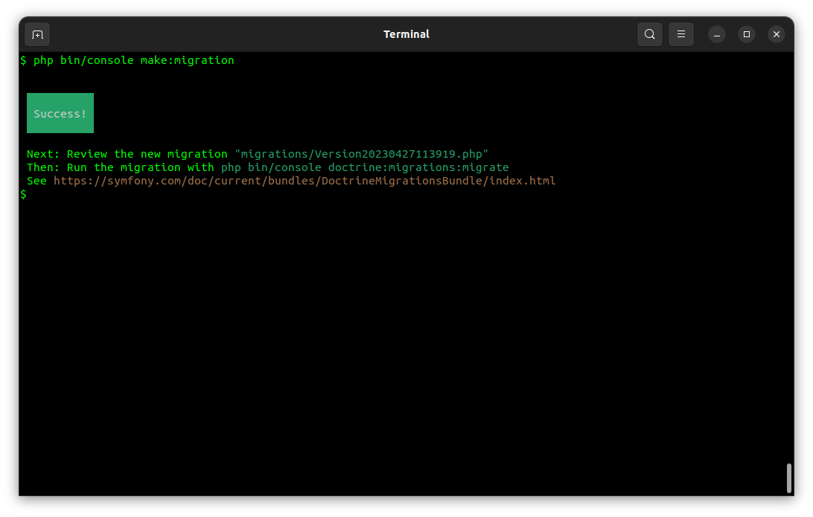

Review the code in the migration file. It is PHP code that executes SQL to the database. Inspect the SQL code and see that it creates the database table. 


You can also see that there are two functions, `up()` and `down()`. This is how a migration work. Each change in the database structure can be added or removed. YOu can upgrade the database schema through `up()` and you can downgrade the database schema through `down()`.

Then run and apply the migration.

```
php bin/console doctrine:migrations:migrate
```

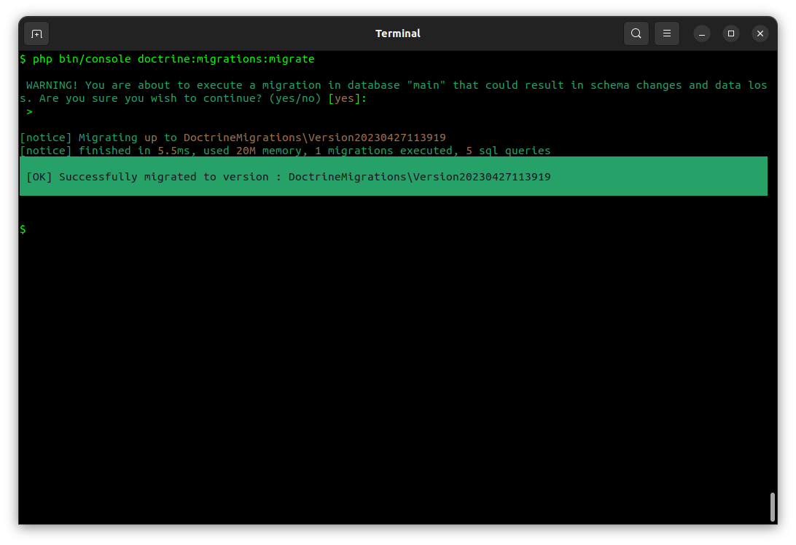

Now you can review the current schema in the database.

```
sqlite3 var/data.db
```

There should be a table that maps to your entity class (and some other utility tables managed by Doctrine).

It looks something like this.


Do not forget to create and run the migration, if and when you update the entity classes.


Create a controller using the entity
---------------------------

Let's create a controller that can use the Product entity.

```
php bin/console make:controller ProductController
```

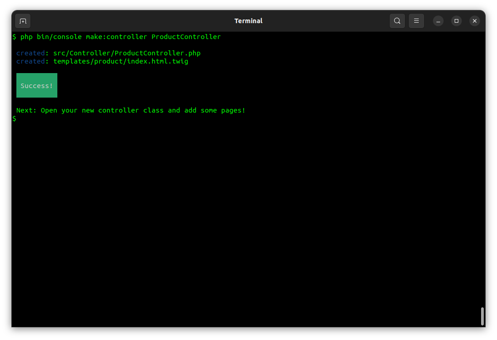

Review the files created.

```
created: src/Controller/ProductController.php
created: templates/product/index.html.twig   
```

Check your routes to see if they works.

```
php bin/console debug:router
php bin/console debug:router product
php bin/console router:match /product
```

Open up the route `/product` in your browser to access the controller handler. It should be a valid route. Ensure that you can see its content (troubleshoot the view and its base view if needed).

It can look like this.

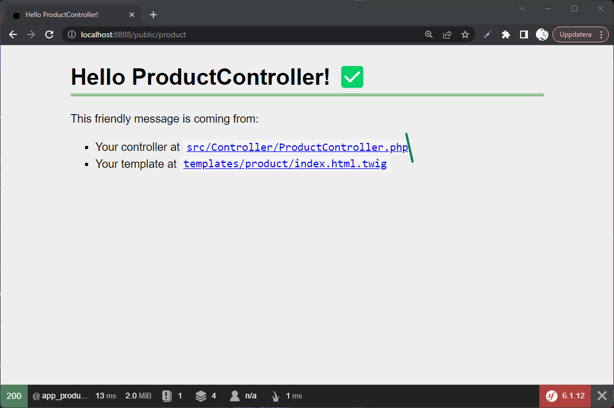


Add a route `product/create`
---------------------------

To your controller, add a new method like this, to create a new product.

Update the namespaces used.

```php
use App\Entity\Product;
use Doctrine\Persistence\ManagerRegistry;
```

This method that creates a new product.

```php
#[Route('/product/create', name: 'product_create')]
public function createProduct(
    ManagerRegistry $doctrine
): Response {
    $entityManager = $doctrine->getManager();

    $product = new Product();
    $product->setName('Keyboard_num_' . rand(1, 9));
    $product->setValue(rand(100, 999));

    // tell Doctrine you want to (eventually) save the Product
    // (no queries yet)
    $entityManager->persist($product);

    // actually executes the queries (i.e. the INSERT query)
    $entityManager->flush();

    return new Response('Saved new product with id '.$product->getId());
}
```

Open the route path in your browser to create a new product into the database.

If you get a "Read-only" error on your database, then make it writable for the user who runs the web server.

```
chmod 666 var/data.db
```

It can look like this when it works.

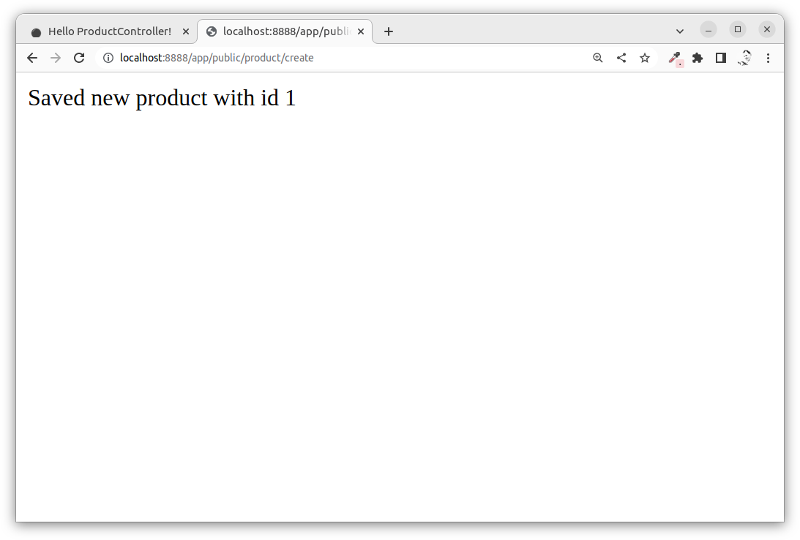

Review the content of your database, your newly created rows should be there.

```
sqlite3 -header -column var/data.db 
```

```
SELECT * FROM Product;
```

It can look something like this.

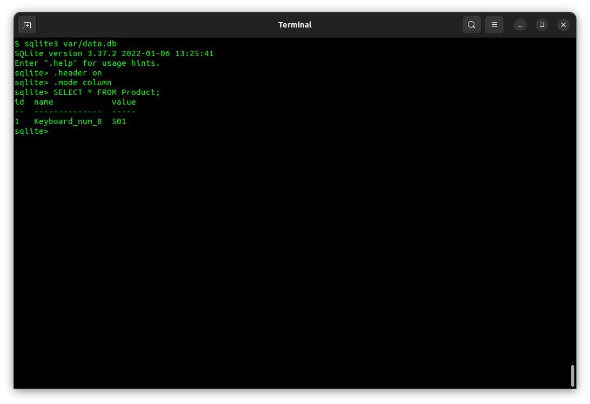


Run SQL toward the database
---------------------------

You can use the console to do pure SQL toward the database.

```
php bin/console dbal:run-sql 'SELECT * FROM product'
```

This makes use of the connection details that your Symfony app is using through the dotenv files.

It can look like this.


Add a route `product/show`
---------------------------

To your controller, add a new method like this, to view all products.

Update the namespace used.

```php
use App\Repository\ProductRepository;
```

```php
#[Route('/product/show', name: 'product_show_all')]
public function showAllProduct(
    ProductRepository $productRepository
): Response {
    $products = $productRepository
        ->findAll();

    return $this->json($products);
}
```

Open the route path in your browser to view the result.

It can look like this.

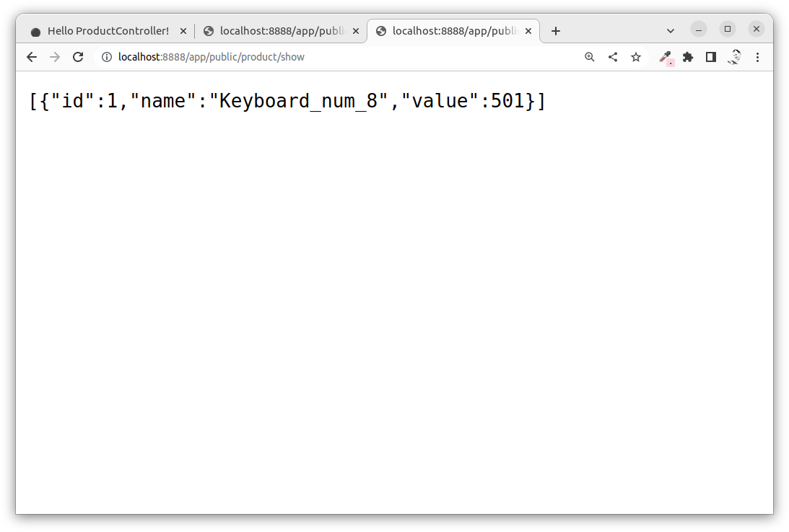

You can enhance the JSON output if you update your code with this.

```php
        $response = $this->json($products);
        $response->setEncodingOptions(
            $response->getEncodingOptions() | JSON_PRETTY_PRINT
        );
        return $response;
```


Add a route `product/show/{id}`
---------------------------

To your controller, add a new method like this, to view a product by its id.

```php
#[Route('/product/show/{id}', name: 'product_by_id')]
public function showProductById(
    ProductRepository $productRepository,
    int $id
): Response {
    $product = $productRepository
        ->find($id);

    return $this->json($product);
}
```

Open the route path in your browser to view the result.

It can look like this.


Add a route `product/delete/{id}`
---------------------------

To your controller, add a new method like this, to delete a product by its id.

```php
#[Route('/product/delete/{id}', name: 'product_delete_by_id')]
public function deleteProductById(
    ManagerRegistry $doctrine,
    int $id
): Response {
    $entityManager = $doctrine->getManager();
    $product = $entityManager->getRepository(Product::class)->find($id);

    if (!$product) {
        throw $this->createNotFoundException(
            'No product found for id '.$id
        );
    }

    $entityManager->remove($product);
    $entityManager->flush();

    return $this->redirectToRoute('product_show_all');
}
```

Open the route path in your browser to view the result.

It can look like this when a product is removed.


Remember that methods that update the state and the database should really be POST and not GET. This method was just simpler to implement to show how to work with Doctrine to update the database.


<!-- Does not work with Symfony 7, the code is not generated in the Repository class

### Alternate implementation

The above code used the `ManagerRegistry` as its implementation, you can reduce the code by using the `ProductRepository` instead. Review the following code and update your implementation to use it instead.

```php
    #[Route('/product/delete/{id}', name: 'product_delete_by_id')]
    public function deleteProductById(
        ProductRepository $productRepository,
        int $id
    ): Response {
        $product = $productRepository->find($id);

        if (!$product) {
            throw $this->createNotFoundException(
                'No product found for id '.$id
            );
        }

        $productRepository->remove($product, true);

        return $this->redirectToRoute('product_show_all');
    }
```

Compare the two implementations and you might see that the second one slighly reduces the code complexity.

Go into the implementation of `$productRepository->remove($product, true);` to verify what the second argument does.
-->


Add a route `product/update/{id}/{value}`
---------------------------

To your controller, add a new method like this, to update a product by its id and provide a new value to it.

```php
#[Route('/product/update/{id}/{value}', name: 'product_update')]
public function updateProduct(
    ManagerRegistry $doctrine,
    int $id,
    int $value
): Response {
    $entityManager = $doctrine->getManager();
    $product = $entityManager->getRepository(Product::class)->find($id);

    if (!$product) {
        throw $this->createNotFoundException(
            'No product found for id '.$id
        );
    }

    $product->setValue($value);
    $entityManager->flush();

    return $this->redirectToRoute('product_show_all');
}
```

First, ensure that you have at least one product that you can edit.

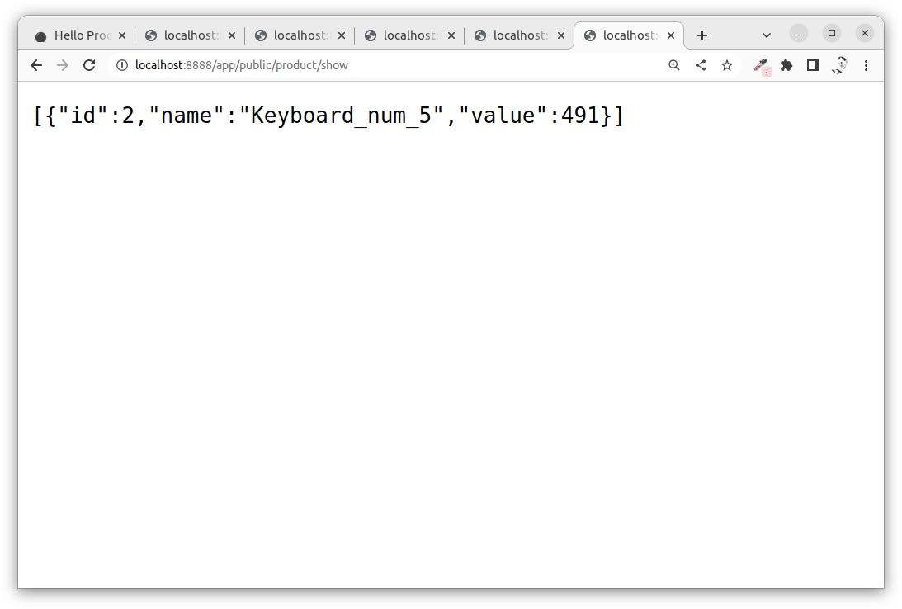

Now open the route path in your browser to edit that product, in my case the url is:

* `/product/update/2/1337`

This is the result.

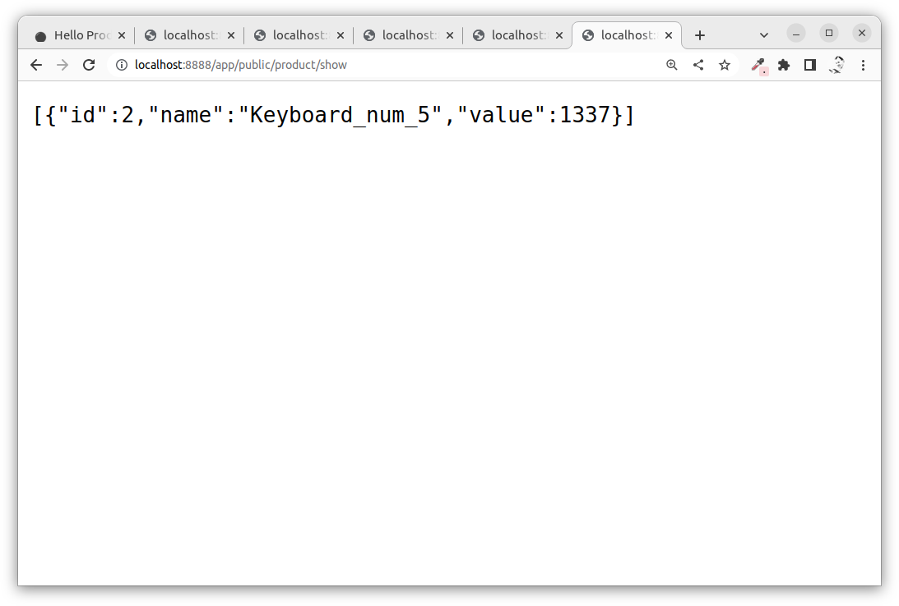

The route edited the product entry and redirected to the result page showing the products.


<!-- Not in Symfony 7
### Alternative implementation

The above code used the `ManagerRegistry` as its implementation, you can reduce the code by using the `ProductRepository` instead. Review the following code and update your implementation to use it instead.

```php
    #[Route('/product/update/{id}/{value}', name: 'product_update')]
    public function updateProduct(
        ProductRepository $productRepository,
        int $id,
        int $value
    ): Response {
        $product = $productRepository->find($id);

        if (!$product) {
            throw $this->createNotFoundException(
                'No product found for id '.$id
            );
        }

        $product->setValue($value);
        $productRepository->save($product, true);

        return $this->redirectToRoute('product_show_all');
    }
```

Compare the two implementations and you might see that the second one slightly reduces the code complexity.
-->


Render all products in a view
--------------------------

This is how you can get and print all products in a Twig view.

Start with a route that renders the results into a Twig view.

```php
#[Route('/product/view', name: 'product_view_all')]
public function viewAllProduct(
    ProductRepository $productRepository
): Response {
    $products = $productRepository->findAll();

    $data = [
        'products' => $products
    ];

    return $this->render('product/view.html.twig', $data);
}
```

Create the template file and add the following loop construct to render all the products into the view.

```twig
<ul>
    
        <li>{{ product.getName|e }} ({{ product.getId|e }}) {{ product.getValue|e }}</li>
    
</ul>
```


Add custom query in the repository
--------------------------

The class `ProductRepository` is the glue between the products and the database and the class is a place where you can add adaptions specific to the products, for example on how to find them.

Here is a method that finds products according to a where statement. Add it to the `ProductRepository`.

```php
/**
 * Find all producs having a value above the specified one.
 * 
 * @return Product[] Returns an array of Product objects
 */
public function findByMinimumValue($value): array
{
    return $this->createQueryBuilder('p')
        ->andWhere('p.value >= :value')
        ->setParameter('value', $value)
        ->orderBy('p.value', 'ASC')
        ->getQuery()
        ->getResult()
    ;
}
```

Then add this route callback that uses the method to display all products having the minimum value.

```php
#[Route('/product/view/{value}', name: 'product_view_minimum_value')]
public function viewProductWithMinimumValue(
    ProductRepository $productRepository,
    int $value
): Response {
    $products = $productRepository->findByMinimumValue($value);

    $data = [
        'products' => $products
    ];

    return $this->render('product/view.html.twig', $data);
}
```

This was an example pn how you can extend your code related to the database by adding it to ProductRepository class. This example used the Query Builder to query the database. Lets review the same example by using pure SQL instead.


### Use SQL in the query

We can rewrite the query using standard SQL instead of using the Query Builder. When using SQL you will get a raw resultset in the form of an array of arrays.

This is how it can look in the `ProductRepository`.

```php
/**
 * Find all producs having a value above the specified one with SQL.
 * 
 * @return [][] Returns an array of arrays (i.e. a raw data set)
 */
public function findByMinimumValue2($value): array
{
    $conn = $this->getEntityManager()->getConnection();

    $sql = '
        SELECT * FROM product AS p
        WHERE p.value >= :value
        ORDER BY p.value ASC
    ';

    $resultSet = $conn->executeQuery($sql, ['value' => $value]);

    return $resultSet->fetchAllAssociative();
}
```

To try it out we use the following controller action.

```php
#[Route('/product/show/min/{value}', name: 'product_by_min_value')]
public function showProductByMinimumValue(
    ProductRepository $productRepository,
    int $value
): Response {
    $products = $productRepository->findByMinimumValue2($value);

    return $this->json($products);
}
```

Try out the code in the `ProductRepository` to verify that it works as expected.

You can read more on how to add these queries to the repository class in the documentation "[Querying for Objects: The Repository](https://symfony.com/doc/current/doctrine.html#querying-for-objects-the-repository)".


SQLite and the production environment
--------------------------

You can now try and push the repo to the student server to verify that the application also works there.

You should be able to see that your local database is uploaded and used on the student server.


Summary
--------------------------

This article showed you how to get going with the database SQLite with Symfony and Doctrine.


Learn more
--------------------------

This is how you can learn more about Doctrine and Symfony and how to use it to work with the database content.


### Build custom queries into Repository object

If you want to add more custom queries into the ProductRepository object you can just add methods to it. There are several ways of writing these methods together with SQL to perform the actual queries.

* [Doctrine Query Language](https://www.doctrine-project.org/projects/doctrine-orm/en/current/reference/dql-doctrine-query-language.html) (almost like SQL but for objects)
* [Query builder](https://www.doctrine-project.org/projects/doctrine-orm/en/current/reference/query-builder.html) (build queries through methods)
* [Native SQL](https://www.doctrine-project.org/projects/doctrine-orm/en/current/reference/native-sql.html) (execute SQL and map results to entities)
* Standard SQL with raw resultsets

You can read more on these different types of techniques and how to extend the ProductRepository with more methods in the article section "[Querying for Objects: The Repository](https://symfony.com/doc/current/doctrine.html#querying-for-objects-the-repository)".

That article also has sections on working with relationships and associations and how to work with testing when databases are involved.

You can read more on relationships and associations "[How to Work with Doctrine Associations / Relations](https://symfony.com/doc/current/doctrine/associations.html)".


### MariaDB as database

This is an optional part that lets you work with the MariaDB as the database.

The first article is "[MariaDB as development environment](README_mariadb_development.md)" showing how to work with MariaDB as a local database.

Then there is the article showing how to use "[MariaDB as production environment on the student server](README_mariadb_production.md)".
