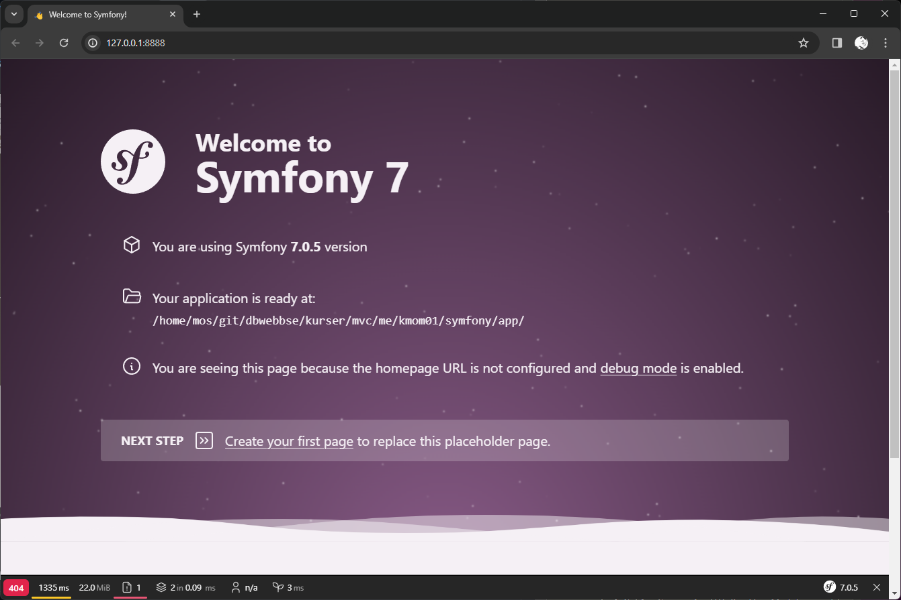
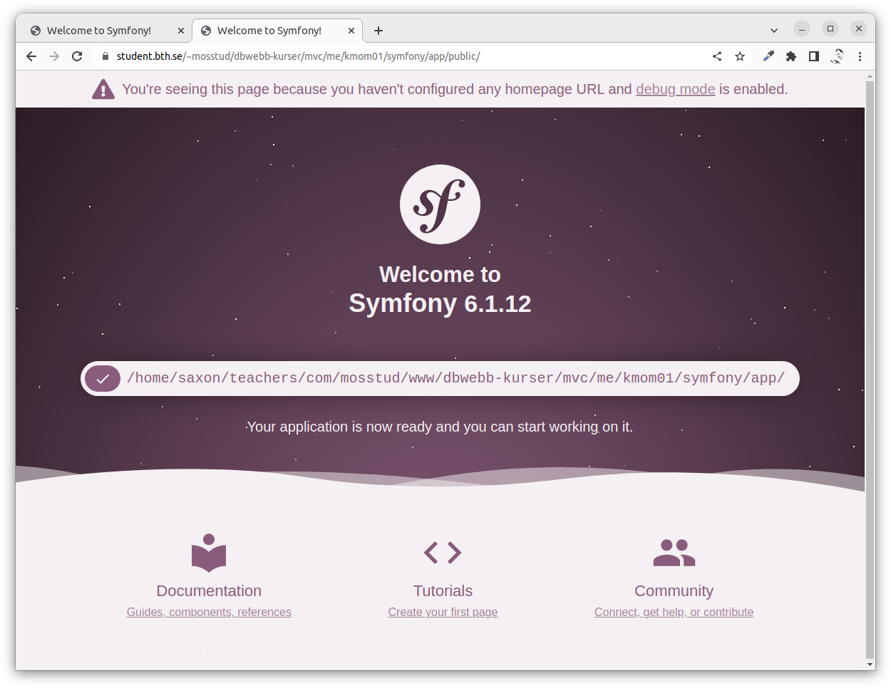
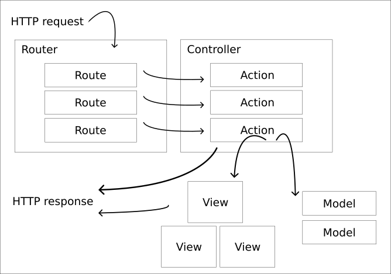
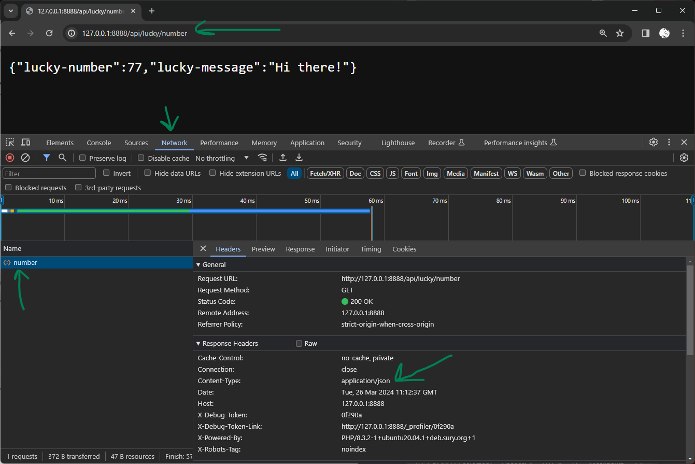
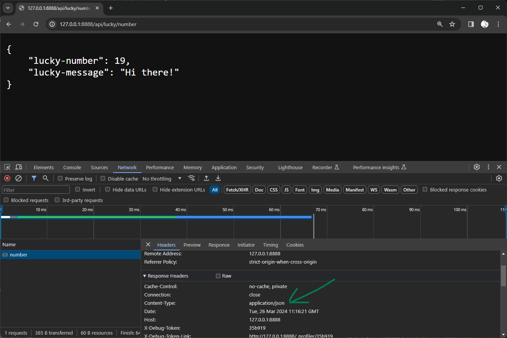
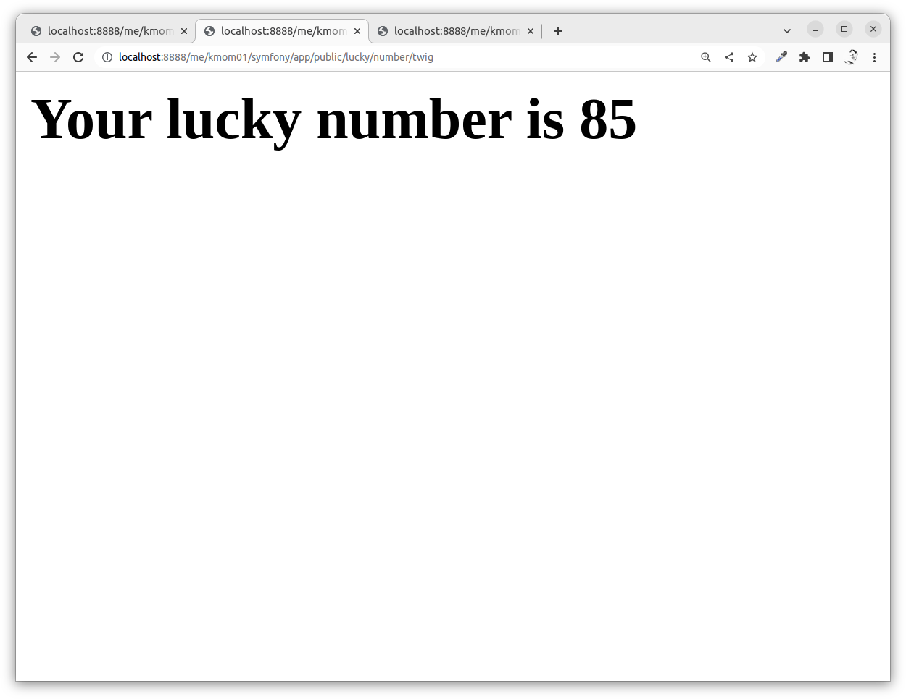
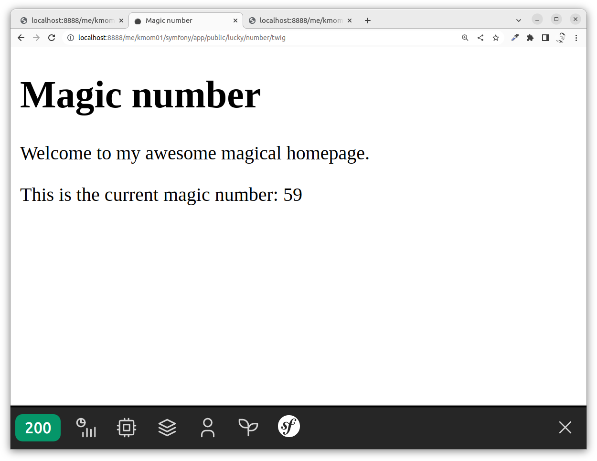
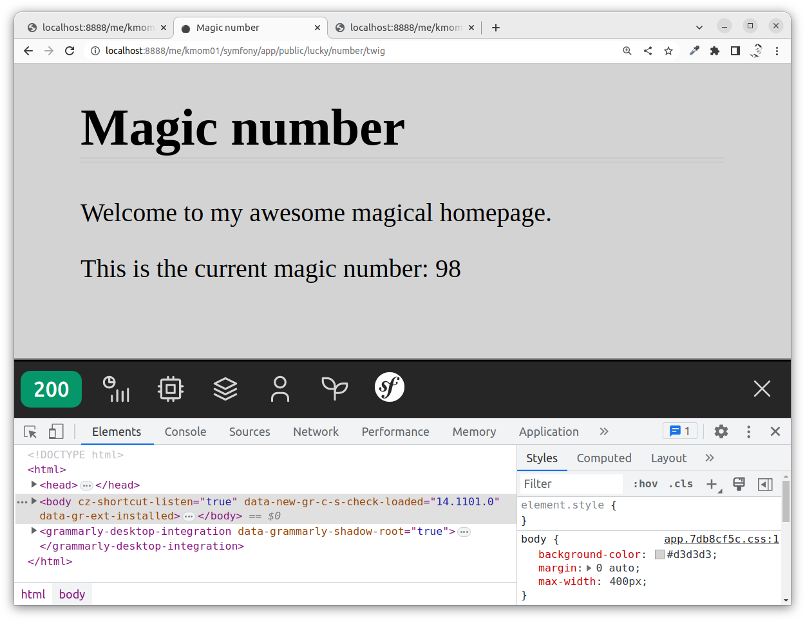
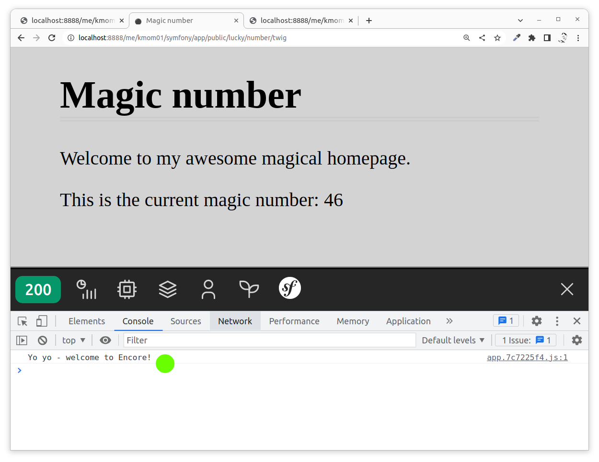
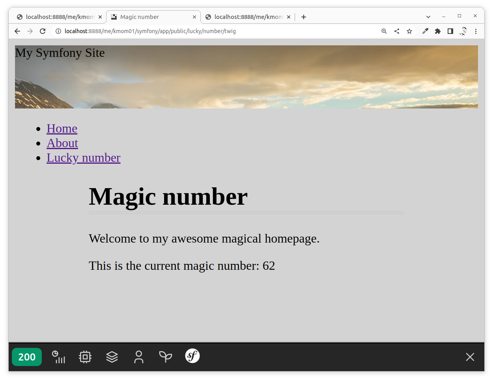

<!--
---
author: mos
revision:
    "2023-03-28": "(B, mos) Work through and very updated."
    "2022-03-27": "(A, mos) First release."
---
-->


Get going with Symfony
====================

This exercise will help you create a web application/service using a Symfony installation.

You will add a controller that serves responses as web pages using a template engine. You will also create a controller that provides and a REST API with JSON responses.

* [Documentation](#documentation)
* [Prerequisites](#prerequisites)
* [Prepare](#prepare)
* [Install the project skeleton](#install-the-project-skeleton)
* [Run your app](#run-your-app)
* [Publish the app to the student server](#publish-the-app-to-the-student-server)
* [Create a home page using a controller](#create-a-home-page-using-a-controller)
    * [Add a controller and a route](#add-a-controller-and-a-route)
    * [The controller class](#the-controller-class)
    * [Use bin/console debug:router](#use-bin-console-debug-router)
    * [Visit the route](#visit-the-route)
    * [Add another route](#add-another-route)
* [Symfony bin/console](#symfony-bin-console)
* [The controller](#the-controller)
* [Add a JSON route](#add-a-JSON-route)
    * [Use a JsonResponse](#use-a-JsonResponse)
    * [JSON pretty print](#json-pretty-print)
* [Add a new controller](#add-a-new-controller)
* [Render a web page using a template](#render-a-web-page-using-a-template)
    * [Install Twig package](#install-twig-package)
    * [Create a controller using twig](#create-a-controller-using-twig)
    * [Create a template file](#create-a-template-file)
    * [Extend a base template](#extend-a-base-template)
* [Include CSS and JavaScript in the base template](#include-CSS-and-JavaScript-in-the-base-template)
    * [Install Encore](#install-Encore)
    * [Setup the project using Encore](#setup-the-project-using-Encore)
    * [Add style](#add-style)
    * [Add JavaScript](#add-JavaScript)
* [Navigate between pages](#navigate-between-pages)
    * [Add routes to home, about](#add-routes-to-home,-about)
    * [Add a navbar](#add-a-navbar)
* [Show images](#show-images)
    * [Ordinary image as asset](#ordinary-image-as-asset)
    * [Add a favicon](#add-a-favicon)
    * [Add a header image](#add-a-header-image)
* [Where to go from here?](#where-to-go-from-here?)


<!--
TODO

* How to send arguments to a route
    * `/api/lucky/number/1/100`
    * How to verify its type
* Session
* Render form using Symfony

* navbar responsive

-->


Documentation
----------------------------

The exercise is built on the [documentation of the Symfony project](https://symfony.com/doc/current). Use the documentation to learn more or as a reference if you get in to trouble.


<!--
Video
----------------------------

There is a playlist on YouTube where Mikael works through this exercise, step by step (in Swedish).

Playlist "[Get going with Symfony](https://www.youtube.com/playlist?list=PLKtP9l5q3ce8KNlbcnlyYInNqwDHxnpH0)".

[](https://www.youtube.com/watch?v=EbeLHSMMs_0&list=PLKtP9l5q3ce8KNlbcnlyYInNqwDHxnpH0)

-->


Prerequisites
----------------------------

You have installed php in the terminal.

You have installed composer.


Prepare
----------------------------

It is assumed that you are working in the course repository.

Start by copying the code for this exercise to your own directory.

```
# Go to the root of the course repo
rsync -av example/symfony me/kmom01
cd me/kmom01/symfony
```


Install the project skeleton
----------------------------

We shall install and setup a skeleton for a Symfony web application using composer.

This part of the exercise comes from the article "[Installing & Setting up the Symfony Framework](https://symfony.com/doc/current/setup.html)". 

Ok, lets start to install a project skeleton using `composer create-project` into the directory `app`.

This creates a traditional Symfony web application.

```
composer create-project symfony/website-skeleton app
cd app
```

You can check what files are available in the app directory. You can see that there are meerly only the file `composer.json`. You can open it to inspect it, it contiains the details that will be installed to setup the Symfony application.

The directory `vendor/` is the place where all downloaded files will be installed and the `composer.lock` contains the snapshot of all packages and versions installed. YOu can inspect the content below the `vendor/` directory to see the structure of the installed packages.

You can now use composer to complete the installation of the web application.

```
composer require webapp
```

The process will start by checking that your system has all the neccessary php extensions before installing.

If you get any questions during the installation procedure, just answer the default reply by pressing enter.

You can check what packages are installed and what versions.

```
composer show
```

Before you proceed, check the content below `vendor/` again.


Run your app
-----------------------

Lets start the application to verify that it works.

You can open the PHP built in webserver to verify the installation.

```
# You are in the app/ directory
php -S localhost:8888 -t public
```

The public web files are all under the `public/` directory so that is the starting point.

You should now be able to open a web browser to `http://localhost:8888` and see the welcome page.




Publish the app to the student server
-----------------------

You can now try to run the application on the student server.

Start by copying the `.htaccess` file to the `public` directory.

```
# You are in the app directory
cp ../.htaccess public
```

The file `.htaccess` will now be in the root of your public web directory and it will setup the paths so the application will work on the student server. This [file can be used to configure the Apache web server](https://httpd.apache.org/docs/2.4/howto/htaccess.html). 

Edit the file `.htaccess` and change 'mosstud' to your own acronym. Do also review that the path seems to be correct.

Publish the application to the student server.

```
dbwebb publishpure me
```

Verify that you can see the welcome page correctly at the student server.




Create a home page using a controller
-----------------------

This shows how to create a home page in Symfony by using a controller. The information is based on the article [create your first page in Symfony](https://symfony.com/doc/current/page_creation.html).


### Add a controller and a route

Copy the controller file containing the code for the route `lucky/number`.

```
cp ../LuckyController.php src/Controller
```

This is the controller class that implements the controller action that is reachable through the route path (route) `lucky/number`.


### The controller class

The controller class looks like this. It is a PHP class using Symfony base classes.

Visit the class in `src/Controller/LuckyController.php` and review the code. Do you understand the structure and its parts?

```php
<?php

namespace App\Controller;

use Symfony\Component\HttpFoundation\Response;
use Symfony\Component\Routing\Annotation\Route;

class LuckyController
{
    #[Route('/lucky/number')]
    public function number(): Response
    {
        $number = random_int(0, 100);

        return new Response(
            '<html><body>Lucky number: '.$number.'</body></html>'
        );
    }
}
```

The controller action `number()` returns the complete html page as the response to the browser.


### Use bin/console debug:router

Now check that the route `lucky/number` is available and that symfony recognizes it. Use the following command in the terminal when you are in the `app/` directory.

```
bin/console debug:router
```

You will se a entry like this, together with all other routes supported in the application.

```
 -------------------------- -------- -------- ------ ---------------
  Name                       Method   Scheme   Host   Path
 -------------------------- -------- -------- ------ --------------- 
  app_lucky_number           ANY      ANY      ANY    /lucky/number
 -------------------------- -------- -------- ------ ---------------
```

The application detects the route path from the attribute (annotation) `@Route("/lucky/number")` in the comment over the method.


### Visit the route

Open the route `lucky/number` in your browser to see that it works. It can look like this.


Inspect the code in the controller and make a few small changes to the web page so you get a feeling of "owning the code".


### Add another route

Now you can try to add another route, just to see that it works. Edit the controller class and add this method.

```php
    #[Route("/lucky/hi")]
    public function hi(): Response
    {
        return new Response(
            '<html><body>Hi to you!</body></html>'
        );
    }
```

Verify that the route is available by checking `bin/console debug:route` and then open it through the browser.

It can look like this.


Symfony bin/console
----------------------------

The tool `bin/console` is a utility that can help develop and troubleshoot your application.

Here are a few examples on how to use it.

```
# Show the routes
bin/console debug:router

# Match a specific route
bin/console router:match /lucky/number

# Clear the cache
bin/console cache:clear

# Show available commands
bin/console
```

Verify that you can match both routes using the command `router:match`.

* `lucky/number`
* `lucky/hi`


The controller
----------------------------

You can read about the structure of a [controller in Symfony](https://symfony.com/doc/current/controller.html) in the docs.

The controller is the C in the design pattern Model View Controller (MVC) and it is the entry point for the application.



The url has a rout path that is intepretated by the (Symfony) router and it leads to a controller action which has the responsability to send a response back to the caller. It may take help of model classes and views when creating the response. In the example code above, the controller used no model classes and no views, it just returned the response directly as a web page.


Add a JSON route
----------------------------

When building a RESTFul API or a web service, the server usually provides a JSON response, instead of serving a web pages as the reponse.

Here follows a `/api/lucky/number` version providing the number in a JSON structure instead of a web page. Add the method to your controller.

```php
    #[Route("/api/lucky/number")]
    public function jsonNumber(): Response
    {
        $this->number = random_int(0, 100);

        $data = [
            'lucky-number' => $this->number,
            'lucky-message' => 'Hi there!',
        ];

        $response = new Response();
        $response->setContent(json_encode($data));
        $response->headers->set('Content-Type', 'application/json');

        return $response;
    }
```

Verify that the route exists and can be used.

It can look something like this when displaying the results in a browser.



You can see that the HTTP response header is saying `application/json` indicating that it the response is a JSON response.


### Use a JsonResponse

You can rewrite the above code and send a `JsonResponse` instead. That is a Symfoy class specialized for JSON data and it slightly reduces your code.

```php
    #[Route("/api/lucky/number")]
    public function jsonNumber(): Response
    {
        $this->number = random_int(0, 100);

        $data = [
            'lucky-number' => $this->number,
            'lucky-message' => 'Hi there!',
        ];

        return new JsonResponse($data);
    }
```

You also need to add the following on the top, to be able to use the class `JsonResponse`.

```php
use Symfony\Component\HttpFoundation\JsonResponse;
```

Add it alphabetically so it looks like this at the top of the controller class.

```php
namespace App\Controller;

use Symfony\Component\HttpFoundation\Response;
use Symfony\Component\HttpFoundation\JsonResponse;
use Symfony\Component\Routing\Annotation\Route;

class LuckyController
```

Verify that the JSON response still works.


### JSON pretty print

When you return a large JSON structure it might sometimes be easier to read if you return it in a formatted way, also known as "pretty print". To do that you can use the following code to format the response before sending it.

```php
        // return new JsonResponse($data);

        $response = new JsonResponse($data);
        $response->setEncodingOptions(
            $response->getEncodingOptions() | JSON_PRETTY_PRINT
        );
        return $response;
```

A formatted pretty print show each property on its own row, so it will be easier to read it.

Update your method so it returns a pretty printed response and verify that it works.

It looks something like this.




Add a new controller
----------------------------

Lets try to add a new controller and move the method we just created doing `/api/lucky/number` into its own `src/Controller/LuckyControllerJson.php`.

Ok? You should then do the following.

1. Create a new controller file `src/Controller/LuckyControllerJson.php`.
1. Add an empty Controller class to it.
1. Move the method doing the `/api/lucky/number` into the class.
1. Verify that it works.

Here is an empty class if you want to start with that.

```php
<?php

namespace App\Controller;

use Symfony\Component\HttpFoundation\Response;
use Symfony\Component\HttpFoundation\JsonResponse;
use Symfony\Component\Routing\Annotation\Route;

class LuckyControllerJson
{

}
```

Always use the same capitalization on the file name and the class name.

The namespace `App\Controller` indicates that the filename should be saved in the directory `src/Controller`. It is a vital mapping that the PHP autoloader is using to find the source files.

Use the command `bin/console` to verify that the route only exists at one class and use your browser to verify that it works.

Now you know how to add new controller classes which is a vital part of structuring your code base.


Render a web page using a template
----------------------------

Lets use a template engine to do the rendering of the `$data` using a template file to create the resulting web page. We are to use the Twig template engine to do this.

Quickly browse the documentation on [the template engine Twig](https://twig.symfony.com/).


### Install Twig package

Start by installing the Twig package.

```
# You are in the app directory
composer require twig
```


### Create a controller using twig

Start by creating a new controller file `src/Controller/LockyControllerTwig.php` and add the following empty class to it.

```php
<?php

namespace App\Controller;

use Symfony\Bundle\FrameworkBundle\Controller\AbstractController;
use Symfony\Component\HttpFoundation\Response;
use Symfony\Component\Routing\Annotation\Route;

class LuckyControllerTwig extends AbstractController
{

}
```

This controller extends the base class `AbstractController` which provides access to helper methods to render the content onto twig templates.

Now add the following method the to `LuckyControllerTwig` class.

```php
    #[Route("/lucky/number/twig", name: "lucky-number")]
    public function number(): Response
    {
        $number = random_int(0, 100);

        $data = [
            'number' => $number
        ];

        return $this->render('lucky_number.html.twig', $data);
    }
```

Use `bin/console` to verify that the route is detected by Symfony.

We still need to add the template file before we can use it.


### Create a template file

Create the file `templates/lucky_number.html.twig` and add the following code to it.

```twig
{# templates/lucky_number.html.twig #}

<h1>Your lucky number is {{ number }}</h1>
```

You can now open the route in your browser and see that it works.

It can look like this.




### Extend a base template

Twig allows you to include other templates by including them, but a more advanced feature is the feature to extend a base template. Twig calls this feature "template inheritance".

There is a file `templates/base.html.twig` and if you inspect it you see a html template file defining blocks which can be overridden by a template extending the base template.

Now take you `templates/lucky_number.html.twig` and rewrite it to look like this.

```twig


Magic number


    <h1>Magic number</h1>
    <p>Welcome to my awesome magical homepage.</p>
    <p>This is the current magic number: {{ number }}</p>

```

It can look like this.




Include CSS and JavaScript in the base template
----------------------------

The base template `templates/base.html.twig` alreayd contains block to setup CSS and JavaScript files.

```twig
        
            {{ encore_entry_link_tags('app') }}
        

        
            {{ encore_entry_script_tags('app') }}
        
```

These blocks uses the Symfony tool Encore to manage static assets like stylesheets and JavaScripts.

Lets add a stylesheet and a JavaScript using the Encore tool.


### Install Encore

First we need to [install Encore](https://symfony.com/doc/current/frontend/encore/installation.html). Here are the few steps to do it.

```
composer require symfony/webpack-encore-bundle
npm install
```

You now have a directory `assets/` and the configuration file `webpack.config.js`. Review the both in your editor.


### Setup the project using Encore

You can read in detail on how to [setup the project using Encore](https://symfony.com/doc/current/frontend/encore/simple-example.html).

To ensure that the stylesheets and the JsvaScript files are included, open up the configuration file `` end edit this line.

```
    .setPublicPath('/build')
```

and remove the first slash to make it work even when the site is published as a subdirectory on the webserver.

```
    .setPublicPath('build')
```

You can now build the assests like this.

```
npm run build
```

This will create a directory `public/build` where all your generated stylesheets and JavaScripts will go. The base template will then include them automatically.

Verify that it works by reloading your browser.


### Add style

You can add your own style to the file `assets/styles/app.css`. Try to add the following and then rebuild the assets.

```css
body {
    margin: 0 auto;
    max-width: 400px;
}

h1 {
    border-bottom: 4px double #ccc;
}
```

Reload the page and it can now look like this.




### Add JavaScript

You can add own Javascript modules. Try creating a file `assets/js/hello.js` and add the following module code to it (you need to create the directory `assets/js`).

```javascript
export default () => {
    return `Yo yo - welcome to Encore!`
}
```

Then include and use the code from the `assets/app.js` like this.

```javascript
import hello from './js/hello';

console.log(hello())
```

Now you can rebuild and the reload your browser to verify that it works.

It can look like this.




Navigate between pages
----------------------------

Lets add a navbar where we can navigate between the pages on the website.


### Add routes to home, about

Lets add two new routes in the class `LuckyControllerTwig` like this.

```php
    #[Route("/home", name: "home")]
    public function home(): Response
    {
        return $this->render('home.html.twig');
    }

    #[Route("/about", name: "about")]
    public function about(): Response
    {
        return $this->render('about.html.twig');
    }
```

You can see that you also need to add the template files that are used. For the time being just add them like this.

* `templates/home.html.twig`

```twig


Home


    <h1>Home</h1>

```

* `templates/about.html.twig`

```twig


About


    <h1>About</h1>

```


### Add a navbar

We now want to add a navbar so we can navigate between the pages.

* Home -> `/home`
* About -> `/about`
* Lucky number -> `lucku/number/twig`

The place to put this is into the base template. We can add it as HTML like this.

```html
<nav>
    <ul>
        <li><a href="{{ path('home') }}">Home</a></li>
        <li><a href="{{ path('about') }}">About</a></li>
        <li><a href="{{ path('lucky-number') }}">Lucky number</a></li>
    </ul>
</nav>
```

We are using the [Twig extension `path()` defined by Symfony](https://symfony.com/doc/current/reference/twig_reference.html#path) to create the url for the navbar.

Reload the page and verify that the navbar works. Perhaps you would like to add some style to the navbar?


Show images
----------------------------

Lets add a few images to the website to ensure that we can link to static assets like images.

We save the images in the directory `public/img` so lets create it.

```
mkdir public/img
```

We need to download a set of images. The following commands downloads two images.

```
curl -s https://upload.wikimedia.org/wikipedia/commons/4/45/Glider.svg > public/img/glider.svg
curl -s 'https://upload.wikimedia.org/wikipedia/commons/thumb/f/f1/Coastal_buildings_of_%C3%85rstein_by_Nordsiveien_road_in_Gratangen%2C_Troms_og_Finnmark%2C_Norway%2C_2022_June.jpg/1280px-Coastal_buildings_of_%C3%85rstein_by_Nordsiveien_road_in_Gratangen%2C_Troms_og_Finnmark%2C_Norway%2C_2022_June.jpg' > public/img/background.jpg
```

Check the content of the directory `public/img` and verify that there are two images there.

Now we add those images to the webpage.


### Ordinary image as asset

First we just add the image to the page `/about` through the template file `templates/about.html.twig` like an ordinary image. We also add a link so if the user clicks on the image, then the image is displayed in its own tab.

```twig

    <h1>About</h1>
    <p>An image which can be clicked on.</p>
    <a href="{{ asset('img/glider.svg') }}">
        
    </a>

```


### Add a favicon

The same way we can add a favicon. This is done in the base template `templates/base.html.twig`.

```twig
    <link rel="icon" href="{{ asset('img/glider') }}">
```

However, note that it already exists an entry for the favicon in the base template, so remove that before adding your own entry.


### Add a header image

We can add a header that has a background image. This is done using CSS and we need to refer to the background image using CSS.

First we add the header section in the base template `templates/base.html.twig`.

```twig
<header class="site-header" style="background-image: url({{ asset('img/background.jpg') }})">
    <span class="site-title">My Symfony Site</span>
</header>
```

The background image is added through the style attribute. That is one of many different ways to do it.

Then we add some extra styling to the `asset/css/app.css`.

```css
.site-header {
    height: 80px;
    background-color: green;
    background-size: cover;
}
```

All together it might look like this.




<!--
Assets
----------------------------

Is this needed?

```
Disable json_manifest_path in
    me/report/config/packages/webpack_encore.yaml

```
framework:
    assets:
        #json_manifest_path: '%kernel.project_dir%/public/build/manifest.json'
```
-->


Where to go from here?
----------------------------

You now know the following about Symfon apps.

* How to install it.
* How to run it.
* How to add a controller and render web pages through views (template files) to your Symfony app.
* How to add routes that produces JSON responses which is an embryo to a RESTful API web service.

You might want to learn more on controllers and routing. Start reading here.

* [Controller](https://symfony.com/doc/current/controller.html)
* [Routing](https://symfony.com/doc/current/routing.html)

You might also find it useful to read up a bit more on Twig.

* [Twig for Template Designers](https://twig.symfony.com/doc/3.x/templates.html)

<!--
Exercise create a form (min, max) that posts to a route generating a random number between min and max.
-->